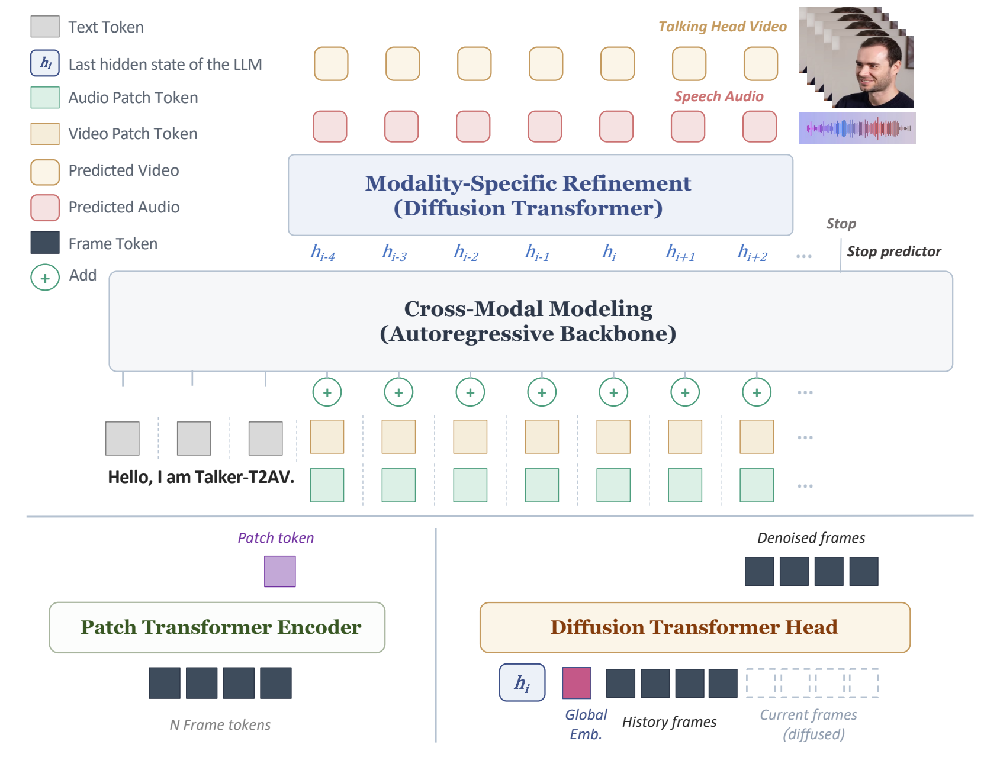

# Talker-T2AV

**Joint Talking Audio-Video Generation with Autoregressive Diffusion Modeling**

[](https://arxiv.org/abs/2604.23586)
[](https://huggingface.co/HKUSTAudio/Talker-T2AV)
[](https://talker-t2av.github.io/)
[](LICENSE)

<p align="center">
  
</p>

Talker-T2AV decouples joint talking audio-video generation into two stages:

1. **Cross-Modal Modeling** — a shared autoregressive backbone (Qwen3-0.6B)
   reasons over text + audio + video in a unified patch-level token sequence.
   Audio and video patch embeddings are summed element-wise at each position.
2. **Modality-Specific Refinement** — two lightweight diffusion transformer
   heads independently denoise the backbone hidden state into 32-d audio
   latents and 40-d motion latents via OT-CFM.

The audio decoder is **WhisperX-VAE** (32-d, 25 Hz) and the video decoder is
**LIA-X** (40-d motion, 25 Hz). A single model supports T2AV (joint
text→audio+video), A2V (audio-driven), and V2A (video dubbing) without
architectural change.

## Installation

```bash
conda create -n talker-t2av python=3.11 -y
conda activate talker-t2av

# torch first (CUDA 12.4 wheel)
pip install --index-url https://download.pytorch.org/whl/cu124 \
    torch==2.6.0 torchaudio==2.6.0 torchvision==0.21.0

# main requirements
pip install -r requirements-eval.txt

# flash-attn (5–15 min build, or grab a prebuilt wheel for torch 2.6 + cu124)
pip install flash_attn==2.7.4.post1 --no-build-isolation

# ffmpeg (LIA-X render needs it). Easiest: reuse the binary from
# the imageio-ffmpeg wheel that pip already installed:
ln -s "$(python -c 'import imageio_ffmpeg; print(imageio_ffmpeg.get_ffmpeg_exe())')" \
      "$CONDA_PREFIX/bin/ffmpeg"
```

## Download checkpoints

The pretrained weights live on HuggingFace at
[HKUSTAudio/Talker-T2AV](https://huggingface.co/HKUSTAudio/Talker-T2AV).
You'll need both **Talker-T2AV** (the AR backbone + diffusion heads) and
**WhisperX-VAE** (the audio autoencoder).

```bash
huggingface-cli download HKUSTAudio/Talker-T2AV \
    --local-dir ./ckpts/hf_weights

# point the inference script at them
export CHECKPOINT_DIR=$(pwd)/ckpts/hf_weights/talker-t2av
export WHISPERVAE_CKPT=$(pwd)/ckpts/hf_weights/whisperx-vae/model.ckpt
```

The video motion autoencoder (**LIA-X**) is fetched separately from
[wyhsirius/LIA-X](https://github.com/wyhsirius/LIA-X). Clone its source and
place the weights, then export `LIAX_CKPT` and `LIAX_CODE_DIR` to those
paths.

## Quickstart

```bash
# minimal: speak the default Chinese demo prompt with the bundled identity / voice
python infer.py

# custom: any text, any reference voice, any reference identity
python infer.py \
    --text "Hello, this is Talker-T2AV." \
    --ref-audio  path/to/voice.wav \
    --ref-motion path/to/lia-x-feature.pt \
    --ref-video  path/to/identity.mp4 \
    --output     out.mp4
```

The script writes `out.mp4` (synced video + audio) and `out.wav` (24 kHz audio
only). Default sampling matches the paper recipe (`t=0.3, cfg=2.0, steps=10,
prefix=0.5 s`).

### Two driving modes via `--gt-prefix-seconds`

The same model supports two qualitatively different generation modes,
selected purely by how much of the reference clip is fed in as a prefix:

- **`--gt-prefix-seconds 0`** — *speaker-/identity-only driving*. The model
  sees the reference audio only through the WavLM speaker embedding (timbre)
  and the reference video only through the first frame (face appearance).
  Speaking style, cadence, and head motion are sampled freely from the
  prior. Use this when you want the **voice and face** of the reference
  but a fresh delivery.

- **`--gt-prefix-seconds N>0`** — * Similar to zero-shot TTS / style cloning* (as in
  the [VALL-E](https://arxiv.org/abs/2301.02111) paper). The
  first `N` seconds of the reference audio + motion are fed through the
  AR backbone before generation starts. The model continues in the
  reference's prosody, rhythm, and head-motion style — like zero-shot
  voice cloning, but for **speech + video together**.

  The prefix can play either of two roles depending on what you put in
  `--ref-audio` / `--ref-motion`:
  - *Cross-sentence* — the reference is a **different** utterance from
    the target text. The model only borrows speaker timbre, prosody,
    and head-motion style; the synthesised content comes entirely from
    `--text`.
  - *Continuation* — the reference is the **beginning of the same
    utterance** you want to produce, and the model continues from where
    the prefix leaves off. Useful for long-form synthesis or seamless
    splicing.

## Repository layout

```
.
├── infer.py                  # entry point — text → talking-head mp4
├── speech_llm.py             # SpeechLLM (AR backbone + dual diffusion heads + stop predictor)
├── unified_cfm.py            # OT-CFM with CFG-zero-star + sway-sampling Euler solver
├── local_dit.py              # Diffusion Transformer Head (VoxCPMLocDiT)
├── llama4nar.py              # Patch Transformer Encoder + bidirectional NAR decoder
├── requirements-eval.txt     # Pinned package list (Python 3.11 + CUDA 12.4)
└── samples/                  # bundled demo data for `python infer.py`
    ├── reference_audio.wav
    ├── reference_motion.pt
    └── reference_video.mp4
```

## Citation

```bibtex
@misc{ye2026talkert2avjointtalkingaudiovideo,
      title={Talker-T2AV: Joint Talking Audio-Video Generation with Autoregressive Diffusion Modeling}, 
      author={Zhen Ye and Xu Tan and Aoxiong Yin and Hongzhan Lin and Guangyan Zhang and Peiwen Sun and Yiming Li and Chi-Min Chan and Wei Ye and Shikun Zhang and Wei Xue},
      year={2026},
      eprint={2604.23586},
      archivePrefix={arXiv},
      primaryClass={cs.CV},
      url={https://arxiv.org/abs/2604.23586}, 
}
```

## License

[Apache License 2.0](LICENSE)

## Acknowledgements

- LLM backbone: [Qwen3](https://github.com/QwenLM/Qwen3)
- Audio autoencoder builds on [X-Codec-2.0](https://github.com/zhenye234/X-Codec-2.0)
- Video motion autoencoder: [LIA-X](https://github.com/wyhsirius/LIA-X)
